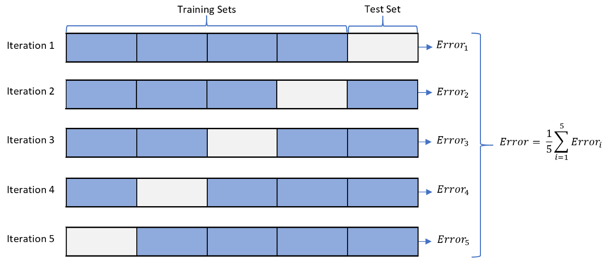

# \[CS231n\] Deep Learning for Computer Vision 学习笔记
参考自https://github.com/mbadry1/CS231n-2017-Summary  
  
  
## 目录
  
  
## 关于课程  
- 网址链接：http://cs231n.stanford.edu/  

- 课程链接：https://www.youtube.com/playlist?list=PLC1qU-LWwrF64f4QKQT-Vg5Wr4qEE1Zxk  

- 教纲链接：http://cs231n.stanford.edu/syllabus.html  

- 作业代码：https://github.com/Burton2000/CS231n-2017  

- 课程章节数： **16**  

- 课程描述：  

  - > Computer Vision has become ubiquitous in our society, with applications in search, image understanding, apps, mapping, medicine, drones, and self-driving cars. Core to many of these applications are visual recognition tasks such as image classification, localization and detection. Recent developments in neural network (aka “deep learning”) approaches have greatly advanced the performance of these state-of-the-art visual recognition systems. This course is a deep dive into details of the deep learning architectures with a focus on learning end-to-end models for these tasks, particularly image classification. During the 10-week course, students will learn to implement, train and debug their own neural networks and gain a detailed understanding of cutting-edge research in computer vision. The final assignment will involve training a multi-million parameter convolutional neural network and applying it on the largest image classification dataset (ImageNet). We will focus on teaching how to set up the problem of image recognition, the learning algorithms (e.g. backpropagation), practical engineering tricks for training and fine-tuning the networks and guide the students through hands-on assignments and a final course project. Much of the background and materials of this course will be drawn from the [ImageNet Challenge](http://image-net.org/challenges/LSVRC/2014/index).  


## 01. Introduction to CNN for visual recognition 卷积神经网络在视觉识别的应用简介  
- 介绍了二十世纪60年代末以来计算机视觉的发展简史；  
- 计算机视觉的主流研究领域：图像分类、物体定位、目标检测、场景理解 等等；  
- [ImageNet](http://www.image-net.org/) 是当今最大的图像分类数据集之一；  
- 自2012年以来，在基于 ImageNet 的图像识别挑战当中，CNN（卷积神经网络）一直展现出强悍的性能；  
- 卷积神经网络 CNN (Convolutional Neural Network) 是法国计算机科学家 [杨乐昆](https://en.wikipedia.org/wiki/Yann_LeCun?wprov=sfla1) 于1997年[首次提出](http://ieeexplore.ieee.org/document/726791/)  
- LeNet: 首个应用CNN概念的神经网络，用于识别手写字母和数字；  
- AlexNet：使用了更深的卷积层，把CNN应用于图像识别，在ImageNet挑战当中把误差下降了近10%；  
- VGG：全部卷积层都使用3x3的卷积核，通过多层堆叠小型卷积核替代大型卷积核（例如2层3x3相当于5x5；3层3x3相当于7x7），简化模型结构，减少模型参数；  
- GoogLeNet：使用了Inception Layer；  
- ResNet：使用跳跃连接，模拟残差的概念，解决了随着层数加深训练效果变差的问题。  
  
## 02. Image Classification 图像分类  
- 图像分类领域有许多富有挑战性的问题，例如：光照 (illumination)、视角变化 (view point)、遮挡 (occlusion) 等等；  
- 图像分类可以采取 kNN 算法 (k nearest neighborhood)，但处理效果较差。  
- kNN 算法的超参数：  
  - k 值：在对象点附近用于对比的样本数；  
  - distance measurement 距离度量：  
    - L2 距离（欧几里得距离，即直线段距离）：适用于无坐标属性的点；  
    - L1 距离（曼哈顿距离，即棋盘格距离）：适用于有坐标属性的点；  
- 可以使用**交叉验证 (Cross Validation)** 的方法来优化超参数（此处我们尝试用 tp 预测 K） 
  
    
    
  1) 把数据集分成 `f` 等份子数据集；  
  2) 给定一组超参数，用其中的 `f-1` 份做训练，剩下的 `1` 份做测试；  
  3) 所有子数据集训练效果的均值作为该组超参数的训练效果；
  4) 更换一组超参数，用与之前不同的 `f-1` 份做训练，剩下的 `1` 份做测试；  
  5) 重复 `f` 次，使每一份都被用作过测试集；  
  6) 选择训练效果最好的超参数作为最终的模型参数。  
- **线性支持向量机（Linear SVM）** 分类器也可用于图像分类，但 [curse of dimensions](https://en.wikipedia.org/wiki/Curse_of_dimensionality) 会导致算法卡在某处无法继续更新参数。  
- **回归分析（Logistic Regression）** 也可用于图像分类，但事实上图像分类是非线性问题  
- **线性分类器（Linear Classifier）** 的本质就是运行方程 `Y = w*X + b`，把输入特征 `X`（例如图像就是一系列RGB数组）转换成信息 `Y`（例如标签）   
  - **模型参数** 包含权重`w` 和偏置`b`，其他与训练相关的参数称之为**超参数（hyperparameter）**  
  - 权重 `w` 的形状和 `X` 相同；偏置 `b` 的形状是1（即标量）  
  - 给 `X` 增加一个元素 `1`，偏置`b`就可以一同写入权重`w`当中  
  - 分类器的目标就是找到可以把特征`X`映射到正确的信息`Y`的一组参数 `w` 和 `b`  
- **激活函数（Activation Function）** 可以为模型引入非线性。线性组合`w*X + b` 并不直接作为输出，而是经由一个激活函数 `f(x)` 传递给Y：`Y = f(w*X + b)`  
  - 激活函数有多种，根据具体任务选用合适的激活函数。常见的有：ReLU(
   
## 03. Loss function and Optimization 损失函数与优化  
  - 上一节我们讨论了线性分类器以及从特征`X`映射到信息`Y`的机制（正向传播），但尚未讨论最优的参数 `w` 和 `b` 是如何**训练**出来的。  
  - 我们需要一个**损失函数（Loss function）** 量化反映当前参数解读输入特征 `X` 的能力。  
    - 使用当前参数计算出一个预测值 `y_pred`，损失函数的任务就是基于预测值 `y_pred` 和标签 `y_truth` 计算一个表现其差距的数值
    - ```python
      Loss = L[i] =(f(X[i],W),Y[i])
      Loss_for_all = 1/N * Sum(Li(f(X[i],W),Y[i]))      # Indicates the average
      ```  
    - 损失函数有多种，但都是与 `|y_pred - y_truth|`呈正相关的，即损失函数越高表示预测值越偏离实际值  
    - 针对不同的任务使用不同的损失函数。常见的例如 L1、L2、交叉熵（Cross Entropy）等等  
  - 有了损失函数，接下来的任务就是**降低损失函数**，缩小预测值和真值之间的差距，提高模型参数辨认特征的准确度。这一过程就是**优化（Optimization）**。  
    - 优化器的形式也有多种，但基本上都遵循**梯度下降（Gradient Descent）** 的思想。  
    - 通过**反向传播（Backpropagation）** ，找到在给定特征输入 `X` 下，损失函数对各个参数的偏导数。所有偏导数组合成的向量构成了损失函数对模型参数的梯度，然后让参数沿着负梯度的方向变化，即向着让损失函数减小的方向变化(变化的速度我们称为**学习率（Learning Rate, lr）**)  
    - 针对不同的任务使用不同的优化器，常见的例如 随机梯度下降SGD、Momentum、RMSProp、Adam 等  


